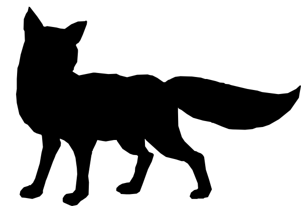

# ALOPEX TEUMESIOS

Alopex Teumesios is a counter-counter-UAS (CCUAS) project under development for the Wright State University course CEG 4980/81: Team Projects I/II

### Alopex Team
* Daniel Franklin, B.S. Computer Science
* Cody Palmer, B.S. Electrical Engineering
* Jacob Routzohn, B.S. Electrical Engineering
* David Sutherin, B.S. Computer Science

### Project Goal
To develop a user-piloted UAS system implementing autonomous detection and avoidance capabilities to evade incoming projectile threats.

### Dependencies
* ArduCopter: [wiki](http://ardupilot.org/copter/docs/introduction.html)

### Installation
* Clone the repository
  * `git clone https://github.com/drsutherin/alopex-teumesios.git`
* cd into the directory
  * `cd alopex-teumesios`
* Initialize and update submodules
  * `git submodule update --init ardupilot/ adam/HB100_test`
* Upload ADAM code to Arduino
* Flash ArduPilot code to SD card
* Rock 'n roll!

### Acknowledgements
* ADAM microwave code based on projects by [3zuli](https://github.com/3zuli/HB100_test) and [kd8bxp](https://www.gitbook.com/book/kd8bxp/arduino-project-doppler-radar-speed-detection-usi/details)
* Alopex logo from [ClipartFest.com](https://clipartfest.com/download/b4f90b1738b49e5a93beff7a8e6bf46830dc337b.html)
